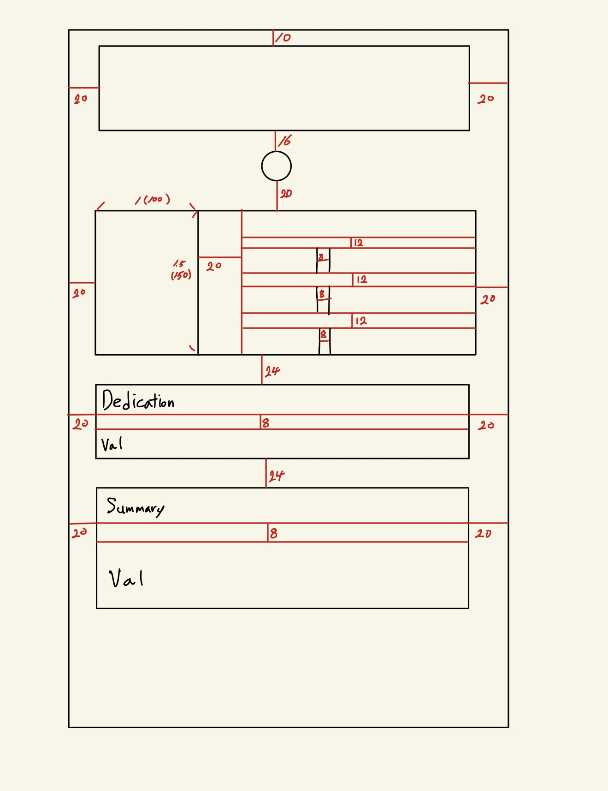
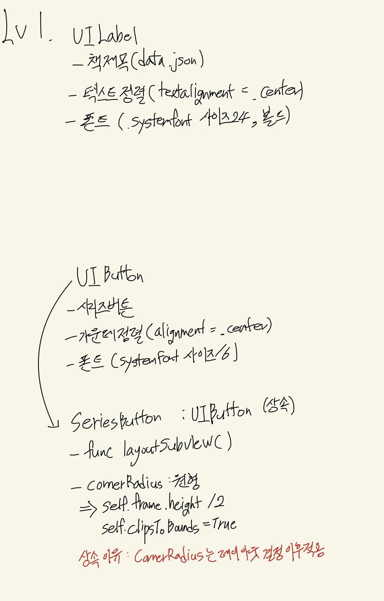
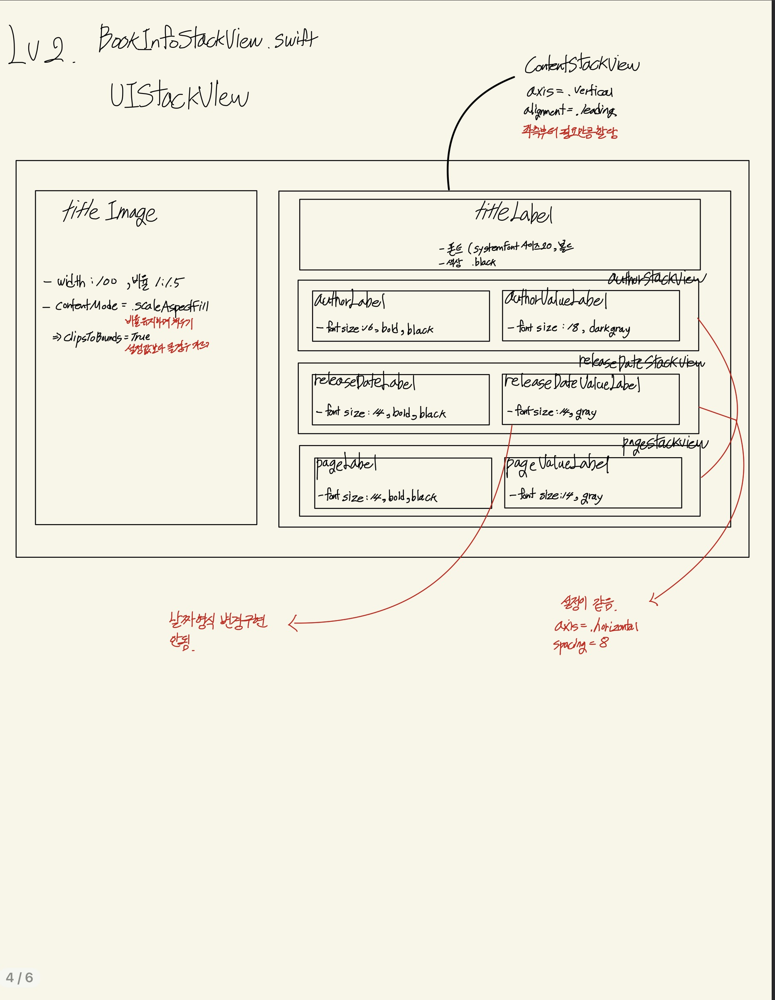
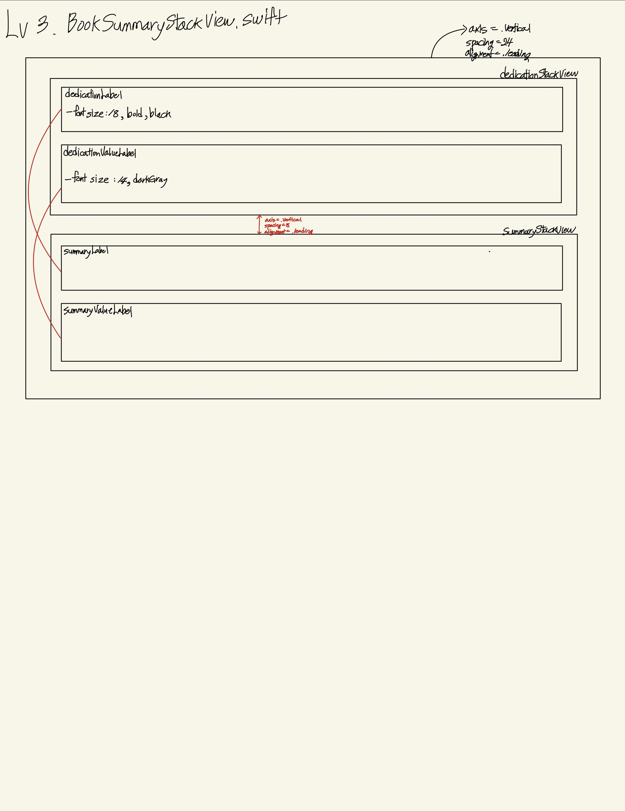

# 책 시리즈 앱 만들기

해리포터 시리즈의 전체 정보를 파싱하여 상세 내용과 챕터 리스트를 보여주는 iOS 애플리케이션입니다. SnapKit을 이용한 코드 기반 레이아웃과 UserDefaults를 활용한 데이터 영속성 처리를 포함하고 있습니다.

## 화면 구상
| Demo | Level 1 | Level 2 | Level 3 |
| :---: | :---: | :---: | :---: |
|  |  |  |  |

---

## 주요 요구사항

### 1. 동적 시리즈 네비게이션
* `data.json` 데이터 개수에 따라 상단 `SeriesButton`이 동적으로 생성됩니다.
* 버튼 클릭 시 해당 권수의 데이터로 화면이 즉시 갱신되며, 스크롤 위치가 최상단으로 자동 초기화됩니다.

### 2. 텍스트 축약 기능 (접기/더보기 버튼)
* 줄거리(`Summary`)가 450자를 초과할 경우 자동으로 축약 모드가 활성화됩니다.
* **사용자 상태 저장**: `UserDefaults`를 활용해 각 도서별로 사용자가 설정한 '접힘/펼침' 상태를 개별적으로 기억합니다.

---

## Project Structure
* **Models**: `BookInfo.swift` (Codable 기반 데이터 모델)
* **Services**: `DataService.swift` (JSON 파싱 및 로컬 데이터 로드)
* **Views**: 
    * `BookInfoStackView`: 도서 커버 및 메인 정보
    * `BookSummaryStackView`: 줄거리 제어 및 상태 저장
    * `BookChapterStackView`: 동적 챕터 리스트 출력
* **Controllers**: `ViewController.swift` (비즈니스 로직 및 이벤트 바인딩)

---
